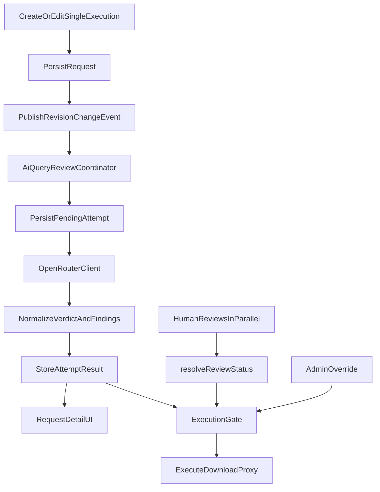

# AI Query Review — Design Specification

**Date:** 2026-08-21  
**Status:** Approved for implementation planning  
**Fork:** `rhapsodixx/kviklet-nitro` (fork of [kviklet/kviklet](https://github.com/kviklet/kviklet))

## 1. Problem

Kviklet already provides a human four-eyes review flow for database execution requests. This fork adds **AI Query Review**: an automated, engine-aware review that runs for every eligible request-approval so reviewers and requesters get an immediate approve / approve-with-notes / reject verdict with concrete fixes.

The AI must not replace the four-eyes principle when configured as a pre-check. It must not permanently close a request on rejection (Kviklet’s existing human `REJECT` is terminal). It must fail closed in Mandatory mode when the provider is unavailable.

## 2. Goals

- Review relational `SingleExecution` SQL against the selected database engine’s best practices.
- Emit structured verdicts: `APPROVED`, `APPROVED_WITH_NOTES`, or `REJECTED`, with findings and fix guidance.
- Support per-connection modes: `DISABLED`, `OPTIONAL`, `MANDATORY`.
- Call OpenRouter with primary model `qwen/qwen3-coder-plus` and automatic fallback `openai/gpt-4o`.
- Enforce Zero Data Retention (ZDR) and deny data-collecting providers.
- Keep human review status independent; Mandatory AI is an additional execution gate.
- Allow fix-and-rerun after AI rejection, plus audited admin override on provider failure.

## 3. Non-goals (v1)

- TemporaryAccess, Dump, MongoDB, or Kubernetes request review.
- Schema introspection, live EXPLAIN, or database tool use by the model.
- AI verdicts counting toward human approval totals.
- Fully autonomous AI final approval without humans.
- UI-managed OpenRouter API keys (keys remain environment/config only).
- Enterprise license gating for this fork feature.

## 4. Decisions summary

| Topic | Decision |
| --- | --- |
| Authority | Per-connection Off / Optional / Mandatory toggle |
| Mandatory AI approval | Pre-check only; still requires all configured human approvals |
| Human timing | Humans may approve in parallel; execution stays blocked until AI passes or is overridden |
| Failure (Mandatory) | Block; allow retry and audited admin override |
| Context sent | SQL + engine + request type + title + description only |
| Models | Qwen primary, GPT-4o automatic fallback |
| Coverage | Datasource `SingleExecution` only |
| AI rejection | Block current revision; re-review after edit |
| Privacy | Require ZDR endpoints; `data_collection: deny` |
| Architecture | First-class revision-scoped AI review state (not synthetic human reviewer) |

## 5. Architecture

### 5.1 Approach

Use **first-class revision-scoped AI review state**, not a synthetic reviewer user writing normal `REVIEW` events.

Reasons:

- Human `REJECT` is terminal (`isRejected()` treats any `REJECT` as permanent). AI rejection must be fixable by editing the same request.
- Human approvals are tallied by author and reset on edit; AI must not inflate or corrupt that tally.
- Pending / failed / overridden states do not map cleanly onto `APPROVE` / `REQUEST_CHANGE` / `REJECT`.

### 5.2 High-level flow



### 5.3 Extension points in existing code

| Concern | Existing location | Change |
| --- | --- | --- |
| Request create/update | [`ExecutionRequestService.kt`](../../../backend/src/main/kotlin/dev/kviklet/kviklet/service/ExecutionRequestService.kt) | After commit, publish revision-change event for AI review |
| Human status | [`ExecutionRequest.kt`](../../../backend/src/main/kotlin/dev/kviklet/kviklet/service/dto/ExecutionRequest.kt) `resolveReviewStatus()` | Leave human logic unchanged |
| Execution gate | `raiseIfNotExecutable()` in `ExecutionRequestService.kt` | Also require current AI revision to be allowed in Mandatory mode |
| Connection config | [`Connection.kt`](../../../backend/src/main/kotlin/dev/kviklet/kviklet/db/Connection.kt), connection forms | Add `aiReviewMode` |
| Request UI | [`RequestSidebar.tsx`](../../../frontend/src/routes/Review/RequestSidebar.tsx), [`request.ts`](../../../frontend/src/hooks/request.ts) | AI badge, panel, pending polling, retry/override actions |
| Notifications | [`NotificationHandler.kt`](../../../backend/src/main/kotlin/dev/kviklet/kviklet/service/NotificationHandler.kt) | Optional later; not required for v1 |

## 6. Configuration

### 6.1 Per-connection mode

Each datasource connection stores:

```text
aiReviewMode: DISABLED | OPTIONAL | MANDATORY
```

Default: `DISABLED`.

Applies only to relational `SingleExecution` requests. TemporaryAccess, Dump, MongoDB, and Kubernetes ignore the setting.

UI placement: connection create/edit forms next to existing review requirements ([`DatabaseConnectionForm.tsx`](../../../frontend/src/routes/settings/connection/DatabaseConnectionForm.tsx) and update form).

Backend validation: setting `OPTIONAL` or `MANDATORY` requires an OpenRouter API key to be configured. The key itself is never returned to the frontend; only a boolean like `aiReviewConfigured` may be exposed for admin UX.

### 6.2 Global OpenRouter settings

Environment / Spring `@ConfigurationProperties` (pattern matches encryption, LDAP, identity provider):

| Property | Purpose | Default |
| --- | --- | --- |
| `kviklet.ai-review.openrouter.api-key` | OpenRouter API key | unset |
| `kviklet.ai-review.openrouter.base-url` | API base URL | `https://openrouter.ai/api/v1` |
| `kviklet.ai-review.primary-model` | Primary model | `qwen/qwen3-coder-plus` |
| `kviklet.ai-review.fallback-model` | Fallback model | `openai/gpt-4o` |
| `kviklet.ai-review.timeout` | Request timeout | `60s` |
| `kviklet.ai-review.max-prompt-chars` | Prompt size limit | `50000` |

Provider routing on every review call:

- `models`: `[primary, fallback]`
- `provider.zdr: true`
- `provider.data_collection: "deny"`
- `provider.require_parameters: true`
- structured outputs via JSON Schema

## 7. Revision identity and state model

### 7.1 Revision fingerprint

Each reviewable revision is identified by SHA-256 over a canonical serialization of:

- datasource engine / type
- SQL statement
- title
- description
- request type (`SingleExecution`)

Any edit that changes those fields produces a new fingerprint. Prior AI results remain in history but are never the active gate for the new revision.

### 7.2 AI review attempt

First-class persisted attempt with at least:

| Field | Description |
| --- | --- |
| `id` | Attempt id |
| `executionRequestId` | Parent request |
| `revisionFingerprint` | Fingerprint reviewed |
| `status` | `PENDING`, `APPROVED`, `APPROVED_WITH_NOTES`, `REJECTED`, `FAILED` |
| `summary` | Short human-readable summary |
| `findings` | Structured list (severity, category, explanation, fix) |
| `suggestedSql` | Optional improved SQL |
| `model` | Actual model used |
| `promptPolicyVersion` | Version of rubric/prompts |
| `errorCategory` | Sanitized failure category when `FAILED` |
| `createdAt` / `completedAt` | Timestamps |

Retries append new attempts; history is append-only.

### 7.3 Admin override

Separate audited record:

| Field | Description |
| --- | --- |
| `executionRequestId` | Parent request |
| `revisionFingerprint` | Exact revision overridden |
| `actorUserId` | Admin who overrode |
| `reason` | Required non-empty reason |
| `createdAt` | Timestamp |

An override is valid only while the request’s current fingerprint matches. Any subsequent edit invalidates it.

### 7.4 Effective AI gate status

For Mandatory mode, execution is allowed only when the **current revision** has:

- latest attempt status in `{APPROVED, APPROVED_WITH_NOTES}`, or
- a matching valid override for a `FAILED` current-revision attempt

Blocked when current revision is `PENDING`, `REJECTED`, `FAILED` without override, missing, or only has an override/result for a different fingerprint.

Optional mode never blocks execution; UI still shows the result when present.

Disabled mode performs no review.

## 8. Lifecycle behavior

### 8.1 Trigger

After a request create or relevant edit is committed:

1. Publish an after-commit revision-change event.
2. `AiQueryReviewCoordinator` ignores unsupported types / `DISABLED` connections.
3. Deduplicate by `(executionRequestId, revisionFingerprint)` so concurrent listeners do not create duplicate in-flight reviews.
4. Persist `PENDING` attempt.
5. Dispatch OpenRouter call on a bounded executor (request HTTP path stays fast).

### 8.2 AI rejection

- Does **not** write a human `REJECT` review event.
- Does **not** permanently close the request.
- Blocks execution in Mandatory mode for that revision.
- UI emphasizes findings and how to fix.
- Requester edits SQL/title/description → new fingerprint → automatic re-review.

### 8.3 Human reviews

- Continue to use existing `REVIEW` / `COMMENT` / `EDIT` / `EXECUTE` events.
- Humans may approve while AI is pending, rejected, or failed.
- Human `resolveReviewStatus()` stays independent.
- Execution still requires both human approval and AI gate (Mandatory).

### 8.4 Provider failure

In Mandatory mode:

1. Attempt becomes `FAILED` with sanitized error category.
2. Execution remains blocked.
3. Any user who can already `GET` the request may call retry for the current revision (rate-limited).
4. Users with `execution_request:override_ai_review` can record an audited override with a required reason when the current attempt is `FAILED` (including timed-out pending treated as failed).
5. Optional mode: show failure warning; do not block.

Transient `429` / `5xx` receive one bounded retry honoring `Retry-After` when present. Model fallback remains OpenRouter’s responsibility via the `models` list.

### 8.5 Stale responses

If a late OpenRouter response arrives for an older fingerprint:

- Persist it against that older fingerprint for audit history.
- Never promote it to the active gate for a newer revision. The active gate always uses the latest attempt (or valid override) for the request’s **current** fingerprint only.

## 9. OpenRouter integration

### 9.1 Input

Send only:

- engine (`POSTGRESQL`, `MYSQL`, `MARIADB`, `MSSQL`)
- SQL statement
- title
- description
- request type

No schema, credentials, connection strings, EXPLAIN plans, or query results.

SQL is delimited as untrusted data in the prompt to reduce prompt-injection risk.

### 9.2 Structured output schema

The model must return JSON matching a strict schema:

```json
{
  "verdict": "APPROVED | APPROVED_WITH_NOTES | REJECTED",
  "summary": "string",
  "findings": [
    {
      "severity": "BLOCKER | WARNING | INFO",
      "category": "string",
      "explanation": "string",
      "fix": "string"
    }
  ],
  "suggestedSql": "string | null"
}
```

Backend validates and size-limits every field before persistence. Invalid or oversized output becomes `FAILED`.

### 9.3 Verdict normalization

Backend derives the effective verdict from findings:

| Condition | Effective status |
| --- | --- |
| Any `BLOCKER` | `REJECTED` |
| No blockers, but warnings/info | `APPROVED_WITH_NOTES` |
| No substantive findings | `APPROVED` |

If the model’s stated verdict disagrees with severity rules, severity rules win.

Rejection must include at least one actionable finding with a concrete fix path. Suggested SQL is optional and only kept when it preserves intent; otherwise findings carry editing guidance.

## 10. Review policy / rubric

### 10.1 Prompt composition

Versioned prompts composed of:

1. Common SQL safety rubric
2. Engine-specific module (PostgreSQL, MySQL, MariaDB, SQL Server)

Prompt policy version is stored on each attempt.

### 10.2 Review dimensions

- Correctness and accidental data loss
- Destructive scope (`DROP`, `TRUNCATE`, unbounded `DELETE`/`UPDATE`)
- Missing predicates / full-table writes
- Transaction and locking risk
- Security (privilege escalation patterns, sensitive data exposure patterns visible in SQL text)
- Performance anti-patterns
- Portability / engine-specific pitfalls
- Maintainability

Because no schema is supplied, the model must not invent indexes, constraints, row counts, or table structure. Schema-dependent advice must be phrased as a verification step.

Clearly intentional but high-risk statements may still be rejected in Mandatory mode. Operators clear that rejection by editing the SQL (new revision → automatic re-review), not by override.

**Override scope (explicit):**

- Allowed only when the current revision’s latest attempt is `FAILED`, or a pending attempt times out and is marked `FAILED`.
- Not allowed to dismiss a successful AI `REJECTED` verdict.
- Not allowed for a fingerprint other than the request’s current fingerprint.

## 11. API and permissions

### 11.1 Request payload additions

Execution request detail responses expose:

- `aiReviewMode` (from connection)
- `aiReview` current-revision summary (latest attempt status, summary, findings, model, timestamps, error category)
- `aiReviewOverride` if a valid current-revision override exists
- `aiReviewBlocksExecution` boolean for UI gating copy

### 11.2 Endpoints

| Endpoint | Purpose | Auth |
| --- | --- | --- |
| Existing GET request | Include AI review fields | `execution_request:get` |
| `POST /execution-requests/{id}/ai-review/retry` | Retry current revision | `execution_request:get` on the request; rate-limited |
| `POST /execution-requests/{id}/ai-review/override` | Record override for current failed revision | `execution_request:override_ai_review`; reason required |

Exact path names may be adjusted in the implementation plan as long as semantics stay the same.

### 11.3 Permission

Add:

```text
execution_request:override_ai_review
```

Default grant: Administrators only. Not implied by ordinary review or execute permissions.

### 11.4 Execution enforcement

Update the shared gate used by execute, download, and other post-approval run paths so Mandatory AI is enforced server-side even if the UI is bypassed.

Dry-run behavior:

- If the connection already requires approval for dry runs, Mandatory AI also applies.
- If dry runs are allowed without approval, AI does not newly require approval for dry runs in v1.

Explain remains subject to existing connection/explain rules; v1 does not specially AI-gate explain beyond existing execute/approval semantics already in place.

## 12. Frontend UX

### 12.1 Connection settings

Off / Optional / Mandatory selector on datasource connection forms. Disable enabling Optional/Mandatory when OpenRouter is not configured, with clear admin messaging.

### 12.2 Request detail

- Compact AI status badge in [`RequestSidebar.tsx`](../../../frontend/src/routes/Review/RequestSidebar.tsx).
- Detailed `AiQueryReviewPanel` above the activity timeline on the request page.
- Panel states: pending, approved, approved-with-notes, rejected (findings + fixes), failed (retry), overridden.
- [`useRequest`](../../../frontend/src/hooks/request.ts) polls only while current AI status is `PENDING`, then stops.
- Execute/download controls explain AI blocks distinctly from missing human approvals.
- Preserve existing human review test IDs and flows.

### 12.3 Rendering safety

Findings and summaries render as plain text / safe markdown consistent with existing comment rendering. Do not treat model output as trusted HTML.

## 13. Security and privacy

- AI has no database connection, tools, schema access, or credentials.
- Treat SQL and model output as untrusted.
- Logs may include request/attempt IDs, selected model, status, latency, sanitized error category.
- Logs must omit SQL, prompts, provider response bodies, and API keys.
- OpenRouter ZDR + deny data collection on every call.
- API key is environment-only; never persisted in the app configuration table; never returned by API.
- Override is audited and revision-bound.
- AI never executes SQL and never reduces the human approval count.

## 14. Data model / migrations

Liquibase changes (next changelog after `048`):

1. Add `ai_review_mode` column to `connection` (string/enum, default `DISABLED`).
2. Create `ai_query_review_attempt` table (or equivalent name) with revision fingerprint, status, findings JSON, model metadata, timestamps, FK to execution request.
3. Create `ai_query_review_override` table with actor, reason, fingerprint, timestamps, FK to execution request.
4. Add indexes for lookup by `(execution_request_id, revision_fingerprint, created_at)`.
5. Seed/update Admin role policy for `execution_request:override_ai_review` as appropriate for this fork’s role initialization patterns.

Exact table/column naming is an implementation detail; semantics above are required.

## 15. Testing and acceptance

### 15.1 Backend

- Unit: fingerprinting, engine prompt selection, response normalization, verdict derivation, current-revision selection, mode/status gate matrix, retry dedupe, override invalidation on edit.
- Mock OpenRouter: auth header, model order, JSON Schema, ZDR/no-collection routing, timeout/retry, malformed responses, sanitized errors, SQL absent from logs.
- Service/controller: review after create/edit, stale completion races, missing API key validation, retry auth, Mandatory blocking, Optional non-blocking, audited overrides.
- Extend existing execution/download tests so Mandatory AI is enforced for relational `SingleExecution`.

### 15.2 Frontend

- Connection mode configuration.
- Panel states and findings rendering.
- Pending-only polling.
- Retry/override authorization visibility.
- Execution-block explanations.

### 15.3 End-to-end

- Approve path.
- Approve-with-notes path.
- Reject → edit → re-review.
- Provider failure → retry.
- Provider failure → override.
- Parallel human approval while AI pending.

### 15.4 CI

- Use a fake OpenRouter server; no token spend or model nondeterminism in CI.
- Optional opt-in smoke test against real OpenRouter with a curated SQL corpus for manual release validation.

### 15.5 Acceptance criteria

1. No older revision result or override can authorize execution of a newer revision.
2. Disabling or bypassing the UI cannot bypass backend Mandatory enforcement.
3. AI rejection never permanently closes the request via human `REJECT` semantics.
4. Successful AI rejection is cleared only by a new revision re-review (edit), not by override.
5. Provider failure in Mandatory mode blocks until retry success or audited override.
6. Optional mode never blocks execution.
7. Only `SingleExecution` relational datasource requests are reviewed in v1.

## 16. Implementation sketch (non-binding file list)

Likely backend additions:

- `AiReviewProperties`, `OpenRouterClient`, `AiQueryReviewService`, `AiQueryReviewCoordinator`
- Liquibase changelog `049-...`
- Connection DTO/entity/controller/form plumbing for `aiReviewMode`
- Permission enum + admin policy seed
- Execution gate helper used by `raiseIfNotExecutable()` / execute paths

Likely frontend additions:

- Connection form control
- `AiQueryReviewPanel`
- Sidebar badge
- API Zod types in `ExecutionRequestApi.ts` / `DatasourceApi.ts`
- Polling in `useRequest`

The implementation plan will sequence these into concrete tasks.

## 17. Open questions resolved during design

All previously open product questions are resolved in Section 4. No remaining product TBD items for v1.

## 18. Next step

After this specification is reviewed and accepted in-repo, create an implementation plan via the writing-plans workflow. Do not implement code until that plan exists and is approved.
